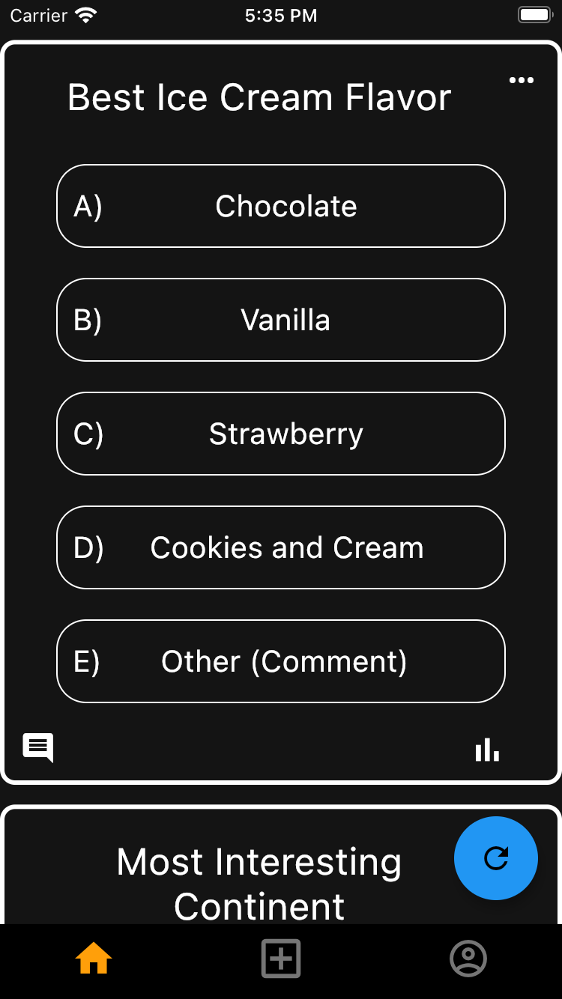
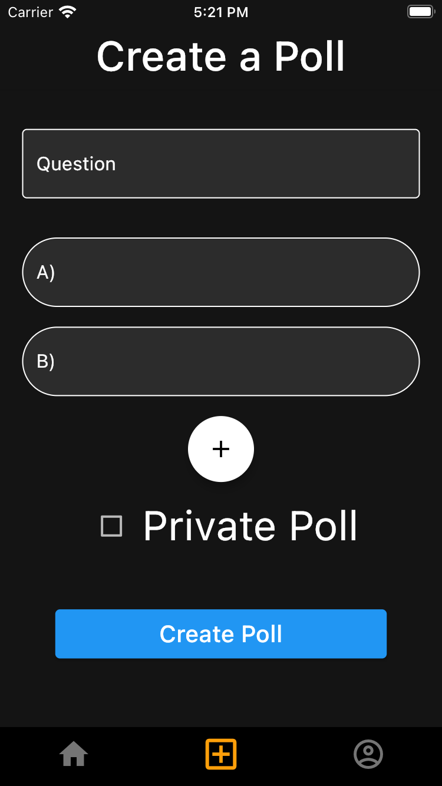
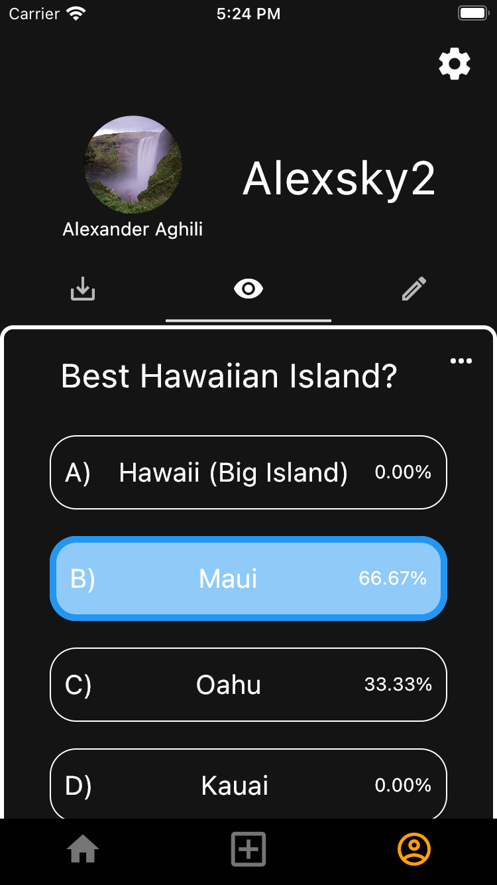

# Public Poll Mobile App - Frontend

This is the README for the frontend of the "Public Poll Mobile App." The frontend is responsible for providing the user interface and interactive experience on mobile devices. Below, you'll find information about the technologies used, how the frontend works, and how to set it up.

## Technologies Used

- **Frontend Language:** Dart
- **Frontend Framework:** Flutter

## Screenshots


*Home Page*


*Create Poll Page*


*Profile Page*

## Setup

To set up and run the frontend of the Public Poll Mobile App, follow these steps:

1. **Prerequisites:**

   - Ensure you have Dart and Flutter installed on your development machine.

2. **Clone the Repository:**

   ```bash
   git clone https://github.com/Alexander-Aghili/PublicPollAppFrontEnd.git
   cd public-poll-app-frontend
   ```

3. **Dependencies Installation:**

   Run the following command to install the required dependencies:

   ```bash
   flutter pub get
   ```

4. **Configuration:**

   - Configure API endpoints and other settings, such as app theme, in the frontend code.

5. **Run the App:**

   Use the following command to run the app on a connected device or emulator:

   ```bash
   flutter run
   ```

6. **Testing:**

   Test the app's functionality on your mobile device or emulator.

## How It Works

The frontend of the Public Poll Mobile App provides a user-friendly interface for interacting with the application's features. Here's an overview of how it works:

- **User Authentication:** Users can sign up and sign in securely using the app. The frontend communicates with the backend to handle user authentication.

- **Poll Viewing:** Users can browse and respond to polls. The app displays polls with questions, answer options, and results.

- **Poll Creation:** Users can create new polls using the app. They can define questions, answer options, and other poll details.

- **User Profile:** The app allows users to view their own profile, including information, saved polls, and polls they've created.

- **Customization:** Users can adjust their personal information and the app's theme (color) through the settings.

- **Real-time Updates:** The frontend may include features for real-time poll updates and notifications.

For more details about the backend and its setup, please refer to the [Backend README](https://github.com/Alexander-Aghili/PublicPollBackEnd/blob/main/README.md) in the linked GitHub repository.
